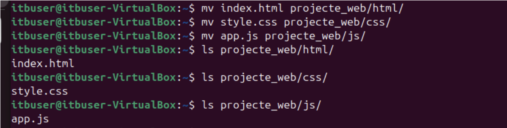
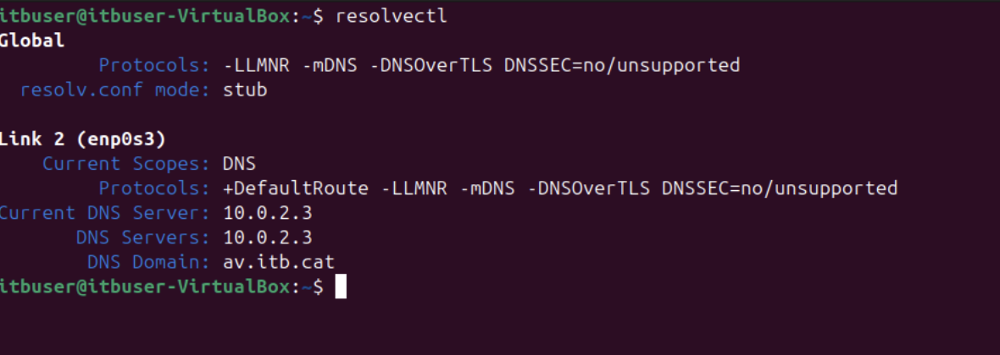

# Activitat 1 de la WS6 - Digitalització aplicada als sectors productius
## Integrants: Adrián Villodres, Alejandro Vergara, Jorge Cabezas, Luca Bulla, María Baos.

# 1. Importació de la màquina virtual
#### Importa al teu VirtualBox una màquina virtual en format .ova que et proporcionarà el professor.

Importem l'arxiu .ova que ens descarreguem del Classroom. Un cop importat, hem de veure això:

#### Configura paràmetres bàsics: memòria RAM, CPU i adaptador de xarxa (triar entre NAT o Bridge).

A paràmetres, podem personalitzar la configuració. Allà seleccionem els paràmetres que volem.

 
#### Verifica que la màquina s’inicia correctament.
Un cop configurat tot, enlleguem la màquina virtual. Si tot funciona correctament, un cop iniciem sessió amb el compte proveït, hauriem de veure l'escriptori. 

# 2. Gestió de fitxers i carpetes amb la terminal

#### Crea una carpeta de projecte (“projecte_web,” per exemple)
Fem servir la comanda `mkdir projecte_web`, després, amb una comanda `ls` podrem veure el nou directori creat.

#### Crea dins l’estructura de carpetes amb html, css, js, assets.
Dins d'aquest directori, crearem les carpetes html, css, js i assets. Ho farem amb diversos mkdir's.

#### Genera a l’arrel de la carpeta de projecte els fitxers (buits o amb contingut): index.html, style.css, app.js.
Com el requeriment ho demana, crearem a la carpeta arrel els respectius arxius. Això ho fem amb comandes `touch <name>`

#### Mou els fitxers a les carpetes corresponents.
Un cop creades, és hora de moure-les. Això ho fem amb `mv <name>`

#### Comprova els permisos d’un fitxer i canvia-los (pista: fer servir la comanda chmod).
Ara comprovarem els permisos que hi ha assignats a un arxiu. Aquests permisos els hem de modificar amb la comanda chmod, on "read" equival a 4 punts, "write" equival a 2 punts i "execute" a 1 punt. Al assignar un número, estem organitzant-ho en els següents "conjunts":

| Conjunts  | Significat |
| ------------- |:-------------:| 
| U      | User     | 
| G      | Group     | 
| O      | Others     |

Això vol dir que, si com al nostre cas, fem `chmod 550 index.html`, estarem donant:
User: Permisos de llegir i executar
Group: Permisos de llegir i executar
Other: No hi tenen permisos

# 3. Conceptes bàsics de xarxa i IPs
#### Comprova l’adreça IP de la teva màquina virtual

Per aquesta comprovació, la comanda a executar és `ip a`. 

#### Fes un ping a la IP de l’host i a una web externa (p. ex. a google.com).
Ara hem de fer un ping a la IP del _host_, així com a una web externa. En aquest cas, Google. L'estructura de la comanda és `ping <ip>`
#### Ping a l’IP de l’host: 

#### Ping a una web externa

#### Consulta quin DNS s’està utilitzant.
Per comprovar la DNS, farem servir `resolvectl`, lo que ens informarà del servidor DNS.

#### Escriu al README.txt una breu explicació de les diferències entre:
##### · IP privada i IP pública.
##### · Xarxa NAT i Bridge.
Una IP privada és l'adreça que identifica al teu dispositiu dins d'una xarxa local (LAN) com la teva casa, oficina o col·legi i només funciona dins d'una xarxa interna és a dir que no és visible en internet, en canvi una IP pública és l'adreça que identifica la teva xarxa enfront d'internet, la dona el teu proveïdor d'internet i és visible des de qualsevol lloc del món i permet que altres servidors i dispositius es puguin comunicar amb tu.
Una xarxa NAT (Network Address Translation) permet la traducció d'adreces IP dins d'una xarxa privada a una direcció IP publica, aquesta tècnica s'implementa en encaminadors o tallafocs per a facilitar la comunicació entre dispositius d'una xarxa interna i la internet en canvi bridge és un dispositiu de xarxa que connecta múltiples subxarxes per a crear una única xarxa i proporciona interconnexió amb altres xarxes informàtiques que utilitzin el mateix protocol. També a través d'un pont es poden connectar diverses xarxes LAN
